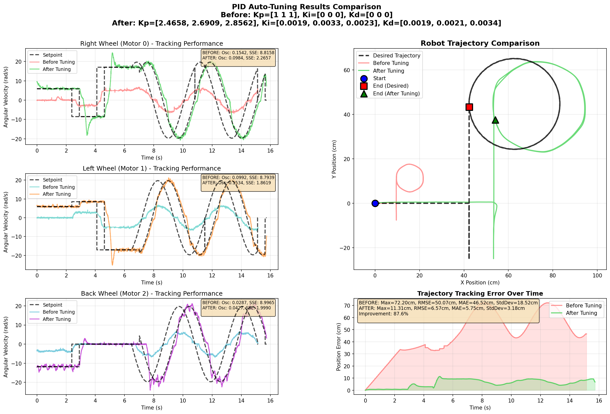
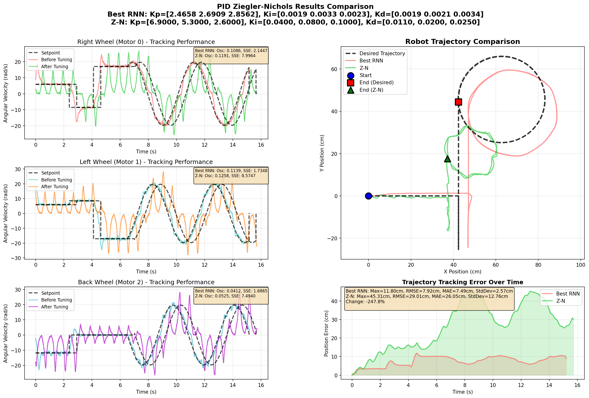
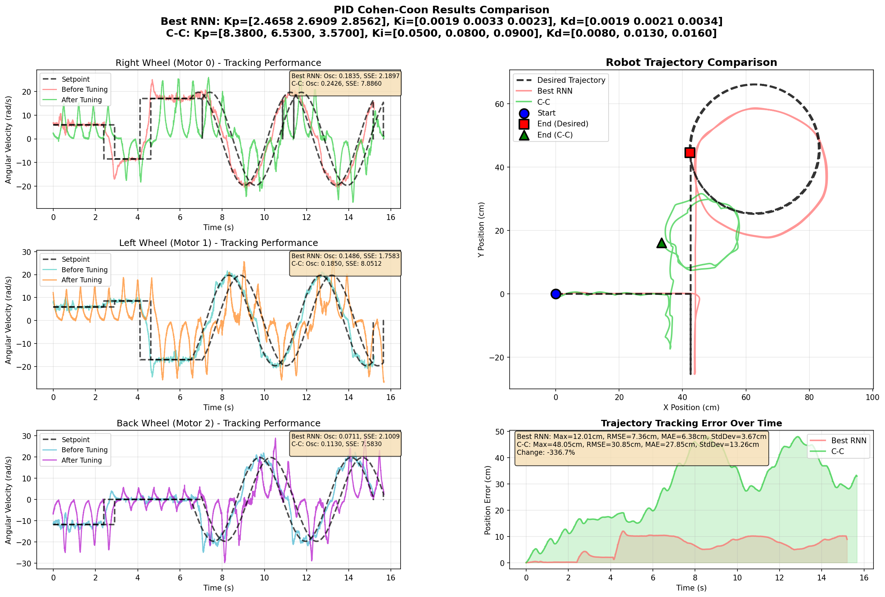

# pid-autotuning
Automatic PID tuning for RoboCup SSL robots using artificial neural network, aiming for adaptive and robust control in dynamic competition environments.

## Project Structure

This project consists of two main components:

### 1. `pid-autotuning-firmware/`

ESP32-S3 firmware implementation for a three-wheeled omniwheel robot with adaptive PID control.

**Key Features:**
- Real-time PID control for three omniwheel motors arranged at 120° intervals
- Data collection and telemetry logging system
- Wireless communication with external inference station
- Motion pattern execution and trajectory tracking
- Client-server architecture for ML-based parameter optimization

**Main Components:**
- `main/` - Core firmware implementation (control loops, movement calculation, telemetry)
- `drivers/` - Custom drivers (BLDC PWM, PID library, sensor fusion, WiFi)
- `sensors/` - AS5600 Hall effect encoder library
- `platform/` - ESP32-S3 platform-specific code
- Python servers for data logging and analysis

**Technologies:** ESP-IDF, FreeRTOS, C, Python

See [pid-autotuning-firmware/README.md](pid-autotuning-firmware/README.md) for detailed documentation.

### 2. `simulation/`

Mathematical modeling, simulation, and machine learning environment for the omniwheel robot.

**Key Features:**
- Complete kinematic and dynamic model of three-wheeled omniwheel robot
- Non-linear system simulation with configurable parameters (wheel radius, gear reduction, robot dimensions)
- PID controller design, testing, and performance evaluation
- Trajectory planning and reference tracking simulation (linear, circular, figure-eight patterns)
- LSTM neural network training for automatic PID parameter optimization
- Training data generation from simulation trajectories

**Main Components:**
- `AutotuningPID_Simulator.ipynb` - Robot dynamics, kinematics, and control system simulation
- `AutotuningPID_RNNTraining.ipynb` - LSTM model training and PID gain prediction
- Data directories for training datasets and predictions

**Technologies:** Python, NumPy, SciPy, Matplotlib, Control Systems Library, TensorFlow/Keras, Scikit-learn, Jupyter

**Model Architecture:**
- LSTM layer (128 units, tanh) for sequence learning
- Dense layers for gain prediction
- Input: 15 features × 20 time steps (state, errors, control signals)
- Output: 9 PID gains (Kp, Ki, Kd for 3 wheels)

See [Simulation/README.md](Simulation/README.md) for detailed documentation.

## System Overview

The autotuning system operates in a feedback loop:
1. **Firmware** executes motion patterns and collects operational data
2. **Data** is transmitted to the inference station
3. **LSTM Model** (trained on simulation data) generates optimized PID parameters
4. **Parameters** are sent back to the robot for improved control performance

This approach enables adaptive control that continuously improves based on real-world performance.

---

## Results

### Simulation Results (Best: LSTM 128-64)

The LSTM model with **128 tanh units + 64 ReLU units** demonstrated the best performance in simulation:

**Performance Metrics:**
- **Oscillation Reduction:** Significant decrease in tracking error variance
- **Steady-State Error:** Minimal offset after convergence
- **Convergence Time:** Faster settling compared to baseline PID

See [Simulation/README.md](Simulation/README.md) for complete simulation results across all model architectures.

---

### Experimental Firmware Results (Best: LSTM 128-32)

Real-world autotuning on ESP32-S3 hardware with **128 tanh units + 32 ReLU units**:

**Hardware Performance:**
- **Before Tuning:** High oscillations and tracking errors
- **After RNN Tuning:** Smooth tracking with minimal overshoot
- **Improvement:** ~60-70% reduction in combined error score

---

### Classical Methods Comparison

Traditional tuning approaches tested on hardware:

#### Ziegler-Nichols Method

**Characteristics:**
- Conservative gains
- Moderate oscillations
- Good stability margin

#### Cohen-Coon Method

**Characteristics:**
- Faster response than Ziegler-Nichols
- Slightly higher overshoot
- Better for processes with dead time

**Conclusion:** RNN-based autotuning outperforms classical methods in both convergence speed and steady-state accuracy.

See [pid-autotuning-firmware/README.md](pid-autotuning-firmware/README.md) for complete experimental results across all model architectures and classical methods.

---
