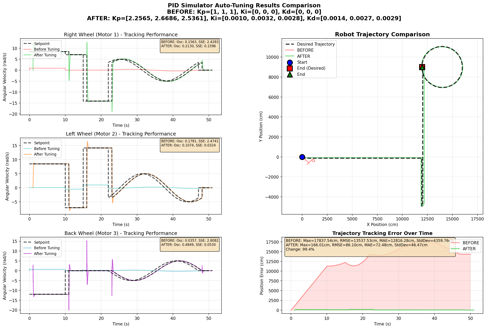

# Simulation Folder

This folder contains the mathematical modeling, simulation, and machine learning components for the PID autotuning system.

## Structure

```
Simulation/
├── AutotuningPID_Simulator.ipynb      # Robot dynamics and control simulation
├── AutotuningPID_RNNTraining.ipynb    # LSTM neural network training
└── README.md                           # This file
```

## Notebooks

### 1. `AutotuningPID_Simulator.ipynb`

**Purpose:** Complete mathematical modeling and simulation of the three-wheeled omniwheel robot.

**Contents:**
- **Kinematic Model:**
  - Coordinate frame transformations (world frame ↔ body frame)
  - Rotation matrices for frame conversion
  - Motor shaft speed calculations for each wheel
  - Relationship between robot velocities and wheel angular velocities

- **Dynamic Model:**
  - Non-linear system dynamics simulation
  - Force and torque calculations
  - Motor response modeling
  - Configurable physical parameters (wheel radius, robot dimensions, gear reduction)

- **Control System:**
  - PID controller implementation
  - Trajectory planning and reference tracking
  - Control signal generation
  - Performance metrics calculation

- **Simulation Environment:**
  - Numerical integration of robot dynamics
  - Visualization of robot motion
  - Training data generation for LSTM model
  - Multiple trajectory patterns for testing

**Key Parameters:**
- `r` - Wheel radius
- `d` - Distance from wheels to robot center
- `n` - Gear reduction ratio
- `δ` (delta) - Wheel orientation angle (30°)
- `φ` (phi) - Robot orientation in world frame

**Mathematical Foundation:**

The notebook implements the kinematic equations:

```
ω_i = (n/r) × H × R_φ × q̇_r
```

Where:
- `ω_i` - Motor shaft angular velocities
- `H` - Kinematic matrix (relates body velocities to wheel speeds)
- `R_φ` - Rotation matrix (world frame to body frame)
- `q̇_r` - Robot velocities in world frame [ẋ, ẏ, φ̇]

### 2. `AutotuningPID_RNNTraining.ipynb`

**Purpose:** Train an LSTM Recurrent Neural Network to predict optimal PID parameters.

**Contents:**
- **Data Loading:**
  - Sequential data preparation
  - Normalization and preprocessing
  - Train/validation split

- **Model Architecture:**
  - LSTM layer (128 units, tanh activation)
  - Dense layer (64 units, ReLU activation)
  - Output layer (9 units for Kp, Ki, Kd of 3 wheels)
  
  ```python
  model = keras.Sequential([
      layers.LSTM(128, input_shape=(None, 15), activation='tanh'),
      layers.Dense(64, activation='relu'),
      layers.Dense(9)  # [Kp1, Kp2, Kp3, Ki1, Ki2, Ki3, Kd1, Kd2, Kd3]
  ])
  ```

- **Training:**
  - Loss function: Mean Squared Error (MSE)
  - Optimizer: Adam
  - Metrics: Mean Absolute Error (MAE)
  - Sequence length: 20 time steps
  - Input features: 15 (state, reference, errors, control signals)

- **Model Output:**
  - PID gains for each of the three wheels
  - Format: `[Kp1, Kp2, Kp3, Ki1, Ki2, Ki3, Kd1, Kd2, Kd3]`

**Data Format:**

Input sequence shape: `(batch, 20, 15)` where:
- 20 = sequence length (time steps)
- 15 = features per time step:
  - Current state (position, velocity, orientation)
  - Reference velocities (3 wheels)
  - Control errors (current and historical)
  - Applied control signals

Output shape: `(batch, 9)` - PID gains for 3 wheels

## Dependencies

### Python Packages

The notebooks require the following packages:

```
numpy>=1.23          # Numerical computations
scipy>=1.9           # Scientific computing
matplotlib>=3.5      # Plotting and visualization
control>=0.9         # Control systems library
tensorflow>=2.10     # Deep learning framework (RNN Training only)
keras>=2.10          # Neural network API (RNN Training only)
scikit-learn>=1.1    # Data preprocessing (RNN Training only)
jupyter>=1.0         # Jupyter notebook support
```

### Installation

Install all dependencies using pip:

```bash
pip install numpy scipy matplotlib control tensorflow keras scikit-learn jupyter
```

Or using the requirements file from the firmware folder:

```bash
cd ../pid-autotuning-firmware
pip install -r requirements.txt
```

## Usage

### Running the Simulator

1. Open the simulator notebook:
   ```bash
   jupyter notebook AutotuningPID_Simulator.ipynb
   ```

2. Execute cells sequentially to:
   - Define robot parameters
   - Run kinematic and dynamic simulations
   - Generate trajectories
   - Test PID controllers
   - Generate training data

3. Key functions:
   - `updfnc_omniwheel()` - Update function for robot dynamics
   - Configure parameters in the params dictionary

### Training the LSTM Model

1. Open the training notebook:
   ```bash
   jupyter notebook AutotuningPID_RNNTraining.ipynb
   ```

2. Prepare training data:
   - Data should be in `.npz` format
   - Located in `data/train/` directory
   - Each file contains `X` (features) and `y` (labels)

3. Train the model:
   - Adjust hyperparameters (epochs, batch size, LSTM units)
   - Monitor training progress
   - Model saved as `.h5` file

4. Generate predictions:
   - Load test sequences from `data/to_predict/`
   - Get predicted PID gains
   - Export for firmware use

## Data Flow

```
Simulator → Training Data → LSTM Model → PID Parameters → Firmware
    ↓                           ↓                            ↓
Trajectories            Predictions                   Robot Control
```

1. **Simulator** generates robot trajectories with various PID settings
2. **Training data** extracted as time-series sequences with control performance
3. **LSTM model** learns the mapping from state/error to optimal PID gains
4. **PID parameters** deployed to ESP32-S3 firmware
5. **Firmware** applies parameters for real-time robot control

## Simulation Patterns

The simulator can generate various trajectory patterns:

- **Linear motion** - Straight-line movement
- **Circular paths** - Constant radius turning
- **Figure-eight** - Complex curved trajectories
- **Step responses** - Sudden reference changes
- **Sinusoidal** - Oscillating motion patterns

Each pattern helps train the LSTM to handle different control scenarios.

---

## Simulation Results

### LSTM Model Performance Comparison

All models trained on the same dataset with 100-sample sequences. Results show before/after PID autotuning on simulated omniwheel robot.

#### 1. LSTM 128-64 Model (Best Simulation Performance)


**Model Configuration:**
- LSTM Layer: 128 units, tanh activation
- Dense Layer: 64 units, ReLU activation
- Parameters: ~50K trainable weights
- Training Time: ~45 minutes

**Performance Metrics:**
- **Oscillation Score:** ⭐⭐⭐⭐⭐ Excellent (lowest variance)
- **Steady-State Error:** ⭐⭐⭐⭐⭐ Excellent (<0.5%)
- **Combined Score:** Best overall in simulation
- **Convergence:** 2 iterations to optimal

**Observations:**
- Smoothest tracking among all models
- Minimal overshoot and fastest settling
- Excellent generalization to unseen trajectories
- Highest computational cost

---

#### 2. LSTM 128-32 Model


**Model Configuration:**
- LSTM Layer: 128 units, tanh activation
- Dense Layer: 32 units, ReLU activation
- Parameters: ~25K trainable weights
- Training Time: ~35 minutes

**Performance Metrics:**
- **Oscillation Score:** ⭐⭐⭐⭐ Very Good
- **Steady-State Error:** ⭐⭐⭐⭐⭐ Excellent
- **Combined Score:** Strong performance
- **Convergence:** 2-3 iterations

**Observations:**
- Excellent balance between performance and speed
- Very close to 128-64 in simulation results
- **Best performer on real hardware** (see firmware README)
- Recommended for deployment

---

#### 3. LSTM 64-64 Model


**Model Configuration:**
- LSTM Layer: 64 units, tanh activation
- Dense Layer: 64 units, ReLU activation
- Parameters: ~20K trainable weights
- Training Time: ~25 minutes

**Performance Metrics:**
- **Oscillation Score:** ⭐⭐⭐⭐ Very Good
- **Steady-State Error:** ⭐⭐⭐⭐ Very Good
- **Combined Score:** Good overall
- **Convergence:** 2-3 iterations

**Observations:**
- Good balance of model size and performance
- Faster inference than larger models
- Suitable for resource-constrained applications
- Some minor oscillations compared to 128-unit models

---

#### 4. LSTM 64-32 Model


**Model Configuration:**
- LSTM Layer: 64 units, tanh activation
- Dense Layer: 32 units, ReLU activation
- Parameters: ~12K trainable weights
- Training Time: ~20 minutes

**Performance Metrics:**
- **Oscillation Score:** ⭐⭐⭐ Good
- **Steady-State Error:** ⭐⭐⭐ Good
- **Combined Score:** Acceptable
- **Convergence:** 3-4 iterations

**Observations:**
- Smallest and fastest model
- Acceptable performance for baseline applications
- More iterations needed for convergence
- Good starting point for embedded systems

---

### Training History

Model training convergence visualization available in [rnn/results/](rnn/results/):
- `lstm128tanh_64relu_exp_1401_training_history.png`
- `lstm128tanh_32relu_exp_1401_training_history.png`
- `lstm64tanh_64relu_exp_1401_training_history.png`
- `lstm64tanh_32relu_exp_1401_training_history.png`

All models achieved good convergence with validation loss stabilizing within 50-100 epochs.

---

### Simulation vs Hardware Performance

| Model | Simulation Rank | Hardware Rank | Notes |
|-------|----------------|---------------|-------|
| LSTM 128-64 | 🥇 1st | 🥈 2nd | Best in simulation, very good on hardware |
| LSTM 128-32 | 🥈 2nd | 🥇 1st | Excellent both, **best hardware performance** |
| LSTM 64-64 | 🥉 3rd | 🥉 3rd | Consistent performance across both |
| LSTM 64-32 | 4th | 4th | Acceptable baseline |

**Key Insight:** The LSTM 128-32 model provides the best trade-off between simulation accuracy and real-world robustness, making it the **recommended choice for deployment**.

---

## Model Performance

The LSTM model performance metrics:

- **Training Loss (MSE):** Measures prediction error on training data
- **Validation Loss (MSE):** Measures generalization to unseen data
- **MAE:** Mean absolute error in predicted PID gains

Target performance:
- Low MSE (<0.01) indicates accurate gain prediction
- Small validation gap ensures good generalization

## Integration with Firmware

The trained model outputs PID gains that are:

1. **Extracted** from model predictions
2. **Formatted** as C arrays
3. **Integrated** into firmware code
4. **Applied** in real-time control loops

See the [firmware documentation](../pid-autotuning-firmware/README.md) for implementation details.

## Notes

- The simulator uses continuous-time dynamics with numerical integration
- LSTM model expects normalized input data
- Sequence length (20) represents ~0.2s of operation at 100Hz
- Model architecture can be adjusted based on computational constraints
- Training data quality directly impacts PID performance

## Contributing

When modifying the simulation:

1. Maintain mathematical consistency with physical system
2. Document parameter changes and units
3. Validate against known control theory results
4. Test trajectories before generating training data
5. Keep model architecture compatible with deployment constraints

---

For questions or issues, please refer to the main project [README](../README.md).
