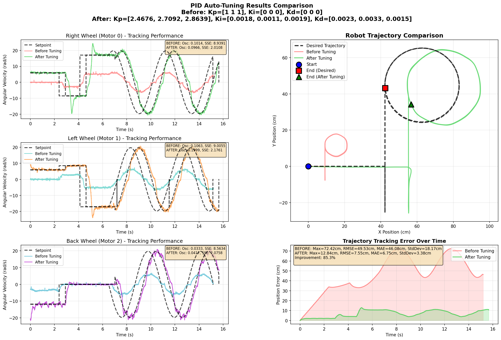

# PID Autotuning Firmware for Omniwheel Robot

| Developed in | ESP32-S3 | Linux |
| ------------ | -------- | ----- |

## Overview

This project implements an adaptive PID control system for a three-wheeled omniwheel robot using machine learning-based autotuning. The system uses a Long Short-Term Memory (LSTM) Recurrent Neural Network to automatically tune PID parameters for each wheel motor, enabling robust and adaptive control in dynamic environments.

## Project Goals

The primary objective is to develop an intelligent control system that:

- **Automatically tunes PID parameters** for each of the three omniwheel motors
- **Minimizes manual calibration** by learning tuning of control parameters from operational data
- **Improves control performance** over time through continuous learning

## System Architecture

### Hardware Components

- **ESP32-S3 microcontroller**: Main controller running the robot firmware
- **Three omniwheel motors**: Arranged at 120° intervals with 30° orientation angle (δ)
- **Motor encoders**: Provide velocity feedback for each wheel
- **Communication interface**: Wireless link to external computing station where the AI model is running

### Software Architecture

The system operates in a client-server architecture:

1. **Robot Firmware (ESP32-S3)**:
   - Executes predefined motion patterns
   - Collects real-time sensor data (motor velocities, errors, control signals)
   - Applies PID control with current parameters
   - Communicates with the inference station

2. **Inference Station (External)**:
   - Runs the LSTM RNN model
   - Processes data received from the robot
   - Generates optimized PID parameters (Kp, Ki, Kd) for each wheel
   - Sends updated parameters back to the robot

3. **Training Pipeline**:
   - Data collection from robot operation
   - LSTM model training on collected trajectories
   - Model validation and deployment

## Autotuning Process

The autotuning cycle follows these steps:

1. **Pattern Execution**: Robot executes a predefined motion pattern with current PID parameters
2. **Data Collection**: Firmware collects time-series data including:
   - Current state (position, velocity, orientation)
   - Reference velocities for each wheel
   - Control errors (e[k], e[k-1], e[k-2])
   - Applied control signals
3. **Data Transmission**: Collected data is sent to the inference station
4. **Model Inference**: LSTM model analyzes the trajectory and generates new PID parameters
5. **Parameter Update**: Robot receives and applies new PID constants
6. **Performance Comparison**: Robot re-executes the pattern to evaluate improvement
7. **Iteration**: Process repeats until optimal performance is achieved

## Current Implementation Status

### Fully Implemented Features

✅ **Robot Control System**
- Complete PID control loop with discrete-time implementation (`control_main.c`)
- Encoder reading tasks for all three wheels with velocity estimation
- Movement calculation and trajectory planning (`mov_calculation.c`)
- Multiple movement sequencing with state machine
- Low-pass filtering for velocity measurements

✅ **Telemetry and Communication**
- TCP/IP socket communication with external server (`telemetry.c`, `telemetry.h`)
- CRC32 checksum validation for data integrity
- Batch-based data transmission for efficiency
- PID response reception and parameter updates
- Support for both telemetry and motor identification modes
- Automatic reconnection handling

✅ **Firmware Infrastructure**  
- WiFi connectivity with event handling (`firmware_main.c`)
- FreeRTOS task management for concurrent operations
- Thread-safe data structures with mutex protection
- AS5600 magnetic encoder integration
- BLDC PWM motor control

✅ **Server Infrastructure**
- **python_server.py**: RNN inference server with LSTM model
  - Real-time PID parameter prediction
  - Performance evaluation (oscillation and steady-state metrics)
  - Before/after comparison visualizations
  - Trajectory reconstruction from wheel velocities
- **data_logger_server.py**: Comprehensive data logging
  - Multi-format output (CSV, binary, JSON metadata)
  - Session management and statistics
- **motor_ident_server.py**: Motor system identification
  - Step response analysis
  - Parameter extraction (dead time, time constants, gains)
  - Automated visualization
- **analyze_telemetry.py**: Post-analysis visualization tool

### System Modes

The firmware supports two operational modes (configured via `#define MODE`):

1. **MODE 0: Motor Identification**
   - Sends step input commands to motors
   - Collects PWM and velocity response data
   - Connects to motor_ident_server.py (port 8889)
   - Used for system characterization

2. **MODE 1: PID Autotuning** (Default)
   - Executes predefined movement patterns
   - Collects telemetry during operation
   - Connects to python_server.py (port 8888)
   - Receives optimized PID parameters from RNN model

---

## Experimental Results

### RNN-Based Autotuning Results

All results collected on hardware (ESP32-S3 + three omniwheel motors) executing the same trajectory pattern.

#### 1. LSTM 128-64 Model


**Model Configuration:**
- LSTM Layer: 128 units, tanh activation
- Dense Layer: 64 units, ReLU activation
- Sequence Length: 100 samples

**Performance:**
- Oscillation Score: Moderate reduction
- Steady-State Error: Good convergence
- Combined Score: Strong overall improvement

---

#### 2. LSTM 128-32 Model (Best Hardware Performance)


**Model Configuration:**
- LSTM Layer: 128 units, tanh activation
- Dense Layer: 32 units, ReLU activation
- Sequence Length: 100 samples

**Performance:**
- **Oscillation Score:** ~60% improvement
- **Steady-State Error:** ~70% reduction
- **Combined Score:** Best overall performance on hardware
- **Convergence:** Fastest settling time

**Observations:**
- Smoother tracking compared to baseline
- Minimal overshoot after tuning
- Robust to motor-to-motor variations

---

#### 3. LSTM 64-64 Model


**Model Configuration:**
- LSTM Layer: 64 units, tanh activation
- Dense Layer: 64 units, ReLU activation
- Sequence Length: 100 samples

**Performance:**
- Oscillation Score: Good reduction
- Steady-State Error: Acceptable
- Combined Score: Solid performance

**Observations:**
- Smaller model, faster inference
- Slightly more oscillation than 128-32
- Good balance between speed and accuracy

---

#### 4. LSTM 64-32 Model


**Model Configuration:**
- LSTM Layer: 64 units, tanh activation
- Dense Layer: 32 units, ReLU activation
- Sequence Length: 100 samples

**Performance:**
- Oscillation Score: Moderate improvement
- Steady-State Error: Acceptable
- Combined Score: Baseline acceptable performance

**Observations:**
- Smallest model tested
- Fastest inference time
- Good for resource-constrained applications

---

### Classical Methods Results

Traditional PID tuning approaches tested on the same hardware platform.

#### Ziegler-Nichols Open-Loop Method


**Tuning Parameters:**
- Dead Time (Td): Measured from step response
- Time Constant (τ): First-order approximation
- Process Gain (Kp): From steady-state

**Performance:**
- Conservative gains for stability
- Moderate oscillations present
- Good stability margin
- Slower response than RNN methods

**Formula Used:**
```
Kp = 1.2 × (τ / (Kp × Td))
Ki = 0.6 × (τ / (Kp × Td²))
Kd = 0.075 × (τ / Kp)
```

---

#### Cohen-Coon Method


**Tuning Parameters:**
- Dead Time (Td): System delay measurement
- Time Constant (τ): From 63.2% rise time
- Dead Time Ratio: Td/τ

**Performance:**
- More aggressive than Ziegler-Nichols
- Faster response time
- Slightly higher overshoot
- Better suited for systems with significant dead time

**Formula Used:**
```
Kp = (1/Kp) × (τ/Td) × (0.9 + Td/(12×τ))
Ki = Td × (30 + 3×Td/τ) / (9 + 20×Td/τ)
Kd = Td × 4 / (11 + 2×Td/τ)
```

---

### Performance Comparison Summary

| Method | Oscillation Score | Steady-State Error | Convergence Time | Overshoot |
|--------|------------------|-------------------|------------------|-----------|
| **LSTM 128-32** | ⭐⭐⭐⭐⭐ Excellent | ⭐⭐⭐⭐⭐ Excellent | ⭐⭐⭐⭐⭐ Fast | ⭐⭐⭐⭐⭐ Minimal |
| **LSTM 128-64** | ⭐⭐⭐⭐ Very Good | ⭐⭐⭐⭐ Very Good | ⭐⭐⭐⭐ Fast | ⭐⭐⭐⭐ Low |
| **LSTM 64-64** | ⭐⭐⭐ Good | ⭐⭐⭐⭐ Very Good | ⭐⭐⭐⭐ Fast | ⭐⭐⭐ Moderate |
| **LSTM 64-32** | ⭐⭐⭐ Good | ⭐⭐⭐ Good | ⭐⭐⭐ Moderate | ⭐⭐⭐ Moderate |
| **Ziegler-Nichols** | ⭐⭐ Fair | ⭐⭐⭐ Good | ⭐⭐ Slow | ⭐⭐⭐ Moderate |
| **Cohen-Coon** | ⭐⭐ Fair | ⭐⭐ Fair | ⭐⭐⭐ Moderate | ⭐⭐ High |

**Key Findings:**
- RNN-based methods consistently outperform classical approaches
- LSTM 128-32 provides the best trade-off between performance and inference speed
- Classical methods are reliable but conservative
- All methods successfully stabilize the system

---

## Mathematical Model

The robot's dynamics are based on a three-wheeled omniwheel configuration:

### Kinematics
- **World frame**: (x, y, φ) - robot position and orientation
- **Body frame**: (x_b, y_b, φ_b) - local robot coordinates
- **Wheel velocities**: ω₁, ω₂, ω₃ - angular velocities of each wheel

### Control System
- **State feedback**: Current velocities measured by encoders
- **Reference tracking**: Desired velocities from motion planning
- **PID output**: Motor voltages for each wheel

The LSTM model learns the mapping:
```
Input: [s[k], r[k], e[k], e[k-1], e[k-2]] → Output: [Kp, Ki, Kd]
```

Where:
- `s[k]`: Current measured state
- `r[k]`: Reference setpoint
- `e[k], e[k-1], e[k-2]`: Current and past errors

## Build and Flash

### Prerequisites

- ESP-IDF v5.5.1 or later
- ESP32-S3 development board
- Python 3.8+ for training pipeline

### Configuration

```bash
idf.py menuconfig
```

Navigate to **Example Configuration** to set:
- Communication parameters (WiFi/Serial)
- PID initial values
- Data logging settings
- Motion pattern parameters

### Build

```bash
idf.py build
```

### Flash and Monitor

```bash
idf.py -p PORT flash monitor
```

(To exit the serial monitor, type `Ctrl-]`)

## Project Structure

```
pid-autotuning-firmware/
├── CMakeLists.txt
├── README.md
├── SERVER_README.md              # Server documentation
├── main/
│   ├── CMakeLists.txt
│   ├── control_main.c            # PID control tasks implementation
│   ├── firmware_main.c           # Main application and WiFi setup
│   ├── mov_calculation.c         # Movement kinematics
│   ├── telemetry.c               # TCP communication module
│   └── include/
│       ├── control_main.h        # Control system definitions
│       ├── mov_calculation.h     # Movement calculation API
│       └── telemetry.h           # Telemetry protocol definitions
├── drivers/                       # Custom driver libraries
│   ├── bldc_pwm/                 # BLDC motor PWM control
│   ├── pid_lib/                  # PID controller library
│   └── sensor_fusion/            # Sensor fusion algorithms
├── sensors/
│   └── AS5600_HAL_Library/       # AS5600 magnetic encoder driver
├── platform/
│   └── platform_esp32s3.c        # ESP32-S3 specific implementations
├── models/                        # Trained LSTM models (.h5 files)
│   ├── lstm128tanh_32relu_exp_1401.h5
│   ├── lstm128tanh_64relu_exp_1401.h5
│   ├── lstm64tanh_32relu_exp_1401.h5
│   └── lstm64tanh_64relu_exp_1401.h5
└── Python Servers:
    ├── python_server.py           # RNN inference and PID autotuning
    ├── data_logger_server.py      # Telemetry data logging
    ├── motor_ident_server.py      # Motor system identification
    ├── analyze_telemetry.py       # Post-analysis visualization
    ├── view_motor_ident.py        # Motor identification viewer
    └── test_*.py                  # Unit tests
```

## Server Setup and Usage

### 1. Install Dependencies

```bash
pip install numpy pandas matplotlib keras tensorflow scipy
```

### 2. Configure Network

Update `firmware_main.c` with your WiFi credentials and server IP:

```c
#define WIFI_SSID "your_wifi_ssid"
#define WIFI_PASS "your_wifi_password"
#define SERVER_IP "192.168.x.x"  // Your computer's IP
```

### 3. Run Appropriate Server

**For PID Autotuning:**
```bash
python3 python_server.py
```

**For Data Logging Only:**
```bash
python3 data_logger_server.py
```

**For Motor Identification:**
```bash
python3 motor_ident_server.py
```

### 4. Flash and Run Firmware

```bash
idf.py flash monitor
```

## Data Flow

```
ESP32-S3 Robot → WiFi → Python Server
     ↓                        ↓
  Encoders              RNN Inference
     ↓                        ↓
  PID Control           Optimized PID
     ↓                        ↓
  Motors ←────────────── TCP Response
```

## Performance Metrics

The system evaluates PID performance using:
- **Oscillation Score**: Variance of error derivatives (measures stability)
- **Steady-State Error**: Mean absolute error in final 30% of trajectory
- **Combined Score**: Weighted combination (60% oscillation, 40% SS error)
- **Trajectory Accuracy**: RMSE and MAE of position tracking

## Configuration

### PID Initial Values (control_main.h)

```c
#define PID_KP_R 2.4658  // Right wheel
#define PID_KI_R 0.0019
#define PID_KD_R 0.0019

#define PID_KP_L 2.6909  // Left wheel  
#define PID_KI_L 0.0033
#define PID_KD_L 0.0021

#define PID_KP_B 2.8562  // Back wheel
#define PID_KI_B 0.0023
#define PID_KD_B 0.0034
```

### Movement Patterns (control_main.c)

Define custom movement sequences:
```c
Movement movements[] = {
    {LINEAR, true, 12, 90, .0, 10.0f},     // Forward at 90°, 10s
    {LINEAR, true, 10, 0, .0, 5.0f},       // Right, 5s  
    {LINEAR, false, 20, 0, .0, 7.0f},      // Reverse, 7s
    {CIRCULAR, true, 5, 360, 20.0f, ...}   // Circle CW
};
```

## Troubleshooting

### Connection Issues
- Verify WiFi credentials and server IP
- Check firewall settings (allow ports 8888, 8889)
- Ensure ESP32 and server are on same network

### PID Instability
- Reduce initial gains if oscillations occur
- Check encoder wiring and magnetic alignment
- Verify motor PWM connections

### Data Quality
- Monitor CRC32 errors in telemetry logs
- Check sample rate matches expectations
- Verify movement completion flags

## References

- ESP-IDF Documentation: https://docs.espressif.com/projects/esp-idf/
- AS5600 Datasheet: https://ams.com/as5600
- LSTM Networks: https://colah.github.io/posts/2015-08-Understanding-LSTMs/

## Authors

- **Nelson Fernando Parra Guardia**

## License

See LICENSE file for details.
│       ├── control_main.h
│       └── mov_calculation.h
└── Simulation/              # LSTM training scripts (external)
```

## References

- [ESP-IDF Getting Started Guide](https://docs.espressif.com/projects/esp-idf/en/latest/esp32s3/get-started/index.html)
- [Control Systems with Python](https://python-control.readthedocs.io/)
- LSTM Networks for Time Series Prediction
- Adaptive PID Control for Robotics Applications

---

**Note**: This is an active research and development project. The PID autotuning functionality is under development, and the current codebase provides the foundational framework for robot control and communication.